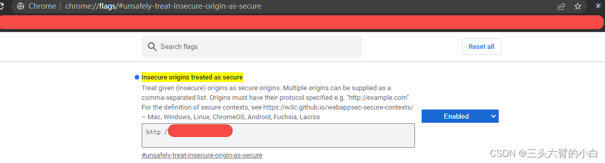

# vscode web 无法预览md
code-server 扩展无法启动，报错‘crypto.subtle‘ is not available so webviews will not work的解决方法  

#### 办法一：
实际上是浏览器在访问 code-server 时候没有使用HTTPS 协议导致的
#### 办法二
方法是进入chrome flag管理界面 chrome://flags/#unsafely-treat-insecure-origin-as-secure 

将对应的 code-server 网址填入对应的网址框，并开启该功能，这样很多 code-server 扩展的问题就解决了。