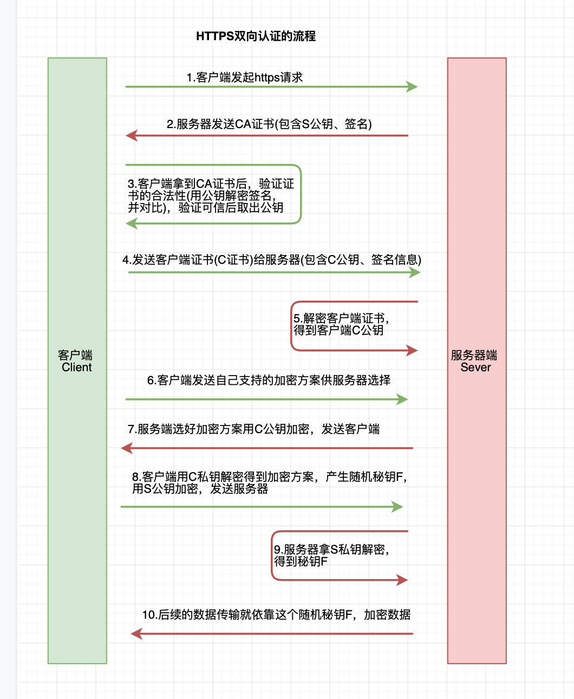

# GRPC认证方式
# 单向认证
<u>缺点：会受中间人攻击</u>
#### 客户端
```
func main() {
    creds, err := credentials.NewClientTLSFromFile("D:\\App\\OpenSSL-Win64\\bin\\grpc\\server.pem", "*.suoy.net")
    if err != nil {
        log.Fatalln("NewServerTLSFromFile error" + err.Error())
    }
    conn, err := grpc.Dial(":8080", grpc.WithTransportCredentials(creds))
}
```
#### 服务端
```
function main() {
    cred, err := credentials.NewServerTLSFromFile("D:\\App\\OpenSSL-Win64\\bin\\grpc\\server.pem", "D:\\App\\OpenSSL-Win64\\bin\\grpc\\server.key")
    if err != nil {
        log.Fatalln("NewServerTLSFromFile error" + err.Error())
    }
    rpcServer := grpc.NewServer(grpc.Creds(cred))
    // 注意 使用grpcui调试需要注册反射
    reflection.Register(rpcServer)
    service.RegisterUserServiceServer(rpcServer, service.UserService)
}
```
### 流程图


# 双向认证
<u>可能会要求对客户端做身份验证，这时就需要做双向认证</u>

### 客户端
```
cert, err := tls.LoadX509KeyPair("D:\\App\\OpenSSL-Win64\\bin\\grpc\\client.pem", "D:\\App\\OpenSSL-Win64\\bin\\grpc\\client.key")
if err != nil {
    log.Fatalln("LoadX509KeyPair error" + err.Error())
}
certPool := x509.NewCertPool()
ca, err := ioutil.ReadFile("D:\\App\\OpenSSL-Win64\\bin\\grpc\\ca.crt")
if err != nil {
    log.Fatalln("ca read error" + err.Error())
}
ok := certPool.AppendCertsFromPEM(ca)
if !ok {
    log.Fatalln("ca append error")
}
cred := credentials.NewTLS(&tls.Config{
    // 证书链，允许多个
    Certificates: []tls.Certificate{cert},
    ServerName: "*.suoy.net",
    // 根证书的集合
    RootCAs: certPool,
})
conn, err := grpc.Dial(":8080", grpc.WithTransportCredentials(cred))
```
### 服务端
```
cert, err := tls.LoadX509KeyPair("D:\\App\\OpenSSL-Win64\\bin\\grpc\\server.pem", "D:\\App\\OpenSSL-Win64\\bin\\grpc\\server.key")
if err != nil {
    log.Fatalln("LoadX509KeyPair error" + err.Error())
}
certPool := x509.NewCertPool()
ca, err := ioutil.ReadFile("D:\\App\\OpenSSL-Win64\\bin\\grpc\\ca.crt")
if err != nil {
    log.Fatalln("ca read error" + err.Error())
}
ok := certPool.AppendCertsFromPEM(ca)
if !ok {
    log.Fatalln("ca append error")
}
cred := credentials.NewTLS(&tls.Config{
    // 证书链，允许多个
    Certificates: []tls.Certificate{cert},
    // 必须校验客户端，可选其它参数
    ClientAuth: tls.RequireAndVerifyClientCert,
    // 根证书的集合
    ClientCAs: certPool,
})
rpcServer := grpc.NewServer(grpc.Creds(cred))
// 注意 使用grpcui调试需要注册反射
reflection.Register(rpcServer)
```
### 流程图


# Token认证
### 客户端
<u>实现 credentials.PerRPCCredentials 接口即可</u>
```
authToken := &auth.CredentialsAuth{Username: "admin", Password: "admin1"}
conn, err := grpc.Dial(":8080", 	grpc.WithTransportCredentials(cred), grpc.WithPerRPCCredentials(authToken))
```
### 服务端
<u>使用拦截器 接收数据进行校验 </u>
```
func main() {
    var interceptor grpc.UnaryServerInterceptor
    interceptor = func(ctx context.Context, req interface{}, info *grpc.UnaryServerInfo, handler grpc.UnaryHandler) (resp interface{}, err error) {
        if err = Auth(ctx); err != nil {
            return
        }
        return handler(ctx, req)
    }
    rpcServer := grpc.NewServer(grpc.Creds(cred), grpc.UnaryInterceptor(interceptor))
}

func Auth(ctx context.Context) error {
	md, ok := metadata.FromIncomingContext(ctx)
	if !ok {
		return status.Error(codes.Unauthenticated, "params error")
	}
	var (
		username string
		password string
	)
	if val, ok := md["username"]; ok {
		username = val[0]
	}
	if val, ok := md["password"]; ok {
		password = val[0]
	}
	if username != "admin" || password != "admin" {
		return status.Error(codes.Unauthenticated, "login error")
	}
	return nil
}
```